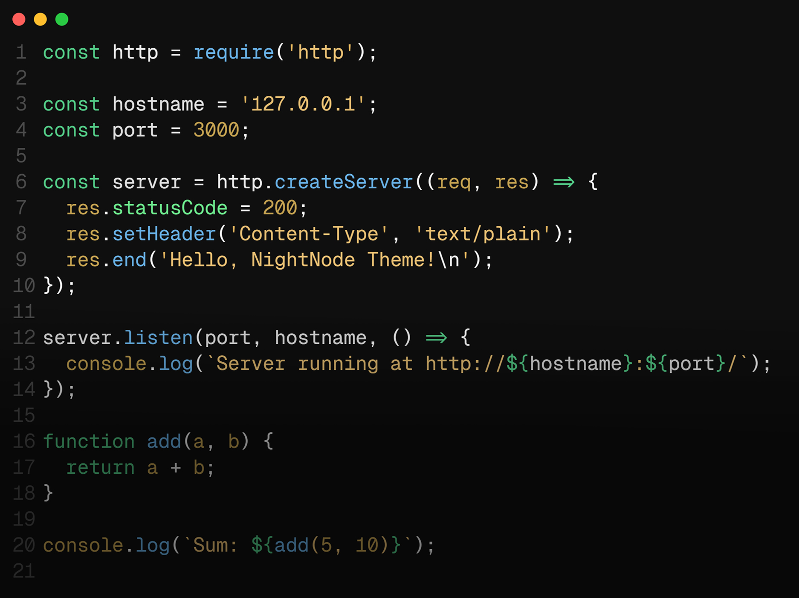

   

<h1  align="center">
  NightNode Theme for VS Code
</h1>

  Dark mode reimagined with Node.js colors — <b>NightNode </b>

### 📸 Screenshots

### ✨ Features

- **Node.js-Inspired Palette**: A color scheme crafted from Node.js hues for a seamless coding experience.
- **Vibrant & Soothing Highlights**: Important elements stand out with vivid, yet calming Node.js colors.
- **Consistent Dark Design**: A unified dark theme that keeps your workspace focused and distraction-free.

### 🚀 Installation

1. Open Visual Studio Code.

2. Go to the Extensions view by clicking on the Extensions icon in the Activity Bar on the side of the window or by pressing `Ctrl+Shift+X`.

3. Search for "NightNode".

4. Click "Install" to install the theme.

5. Click "Reload" to reload your editor, and the theme will be applied.

### 🛠 Customization

Feel free to customize the theme to your liking by editing the `settings.json` file in your VS Code configuration. You can tweak the colors, fonts, and other settings to make NightNode truly your own.

---

**Designed and developed by** [Ayush Khatri](https://ayushkhatri.site)
Thank you for choosing NightNode. Enjoy your coding journey in the shadows!
