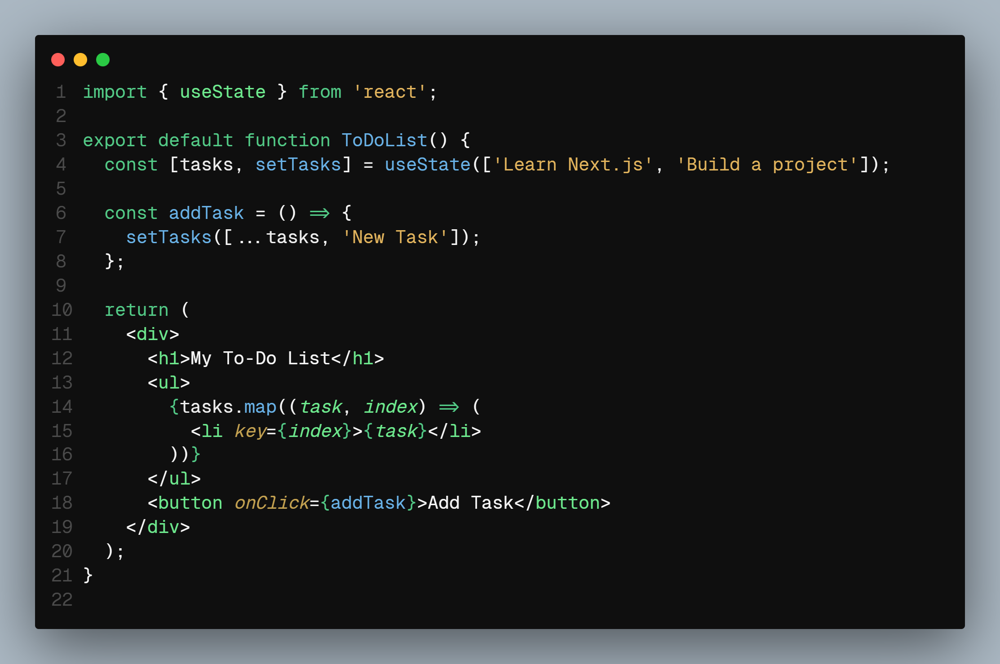
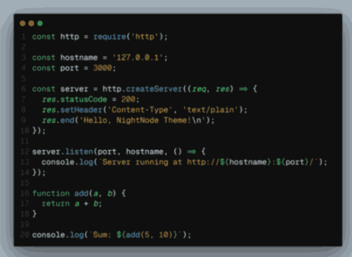

# NightNode - A node Dark Theme for Developers

## 🌙 NightNode: Code in the Shadows

Welcome to **NightNode**, the ultimate dark theme designed for developers who thrive in the calm of the night.

### 📸 Screenshots

### ✨ Features

- **Balanced Color Palette**: Carefully selected colors that enhance readability while reducing eye strain.
- **Vibrant Highlights**: Key elements like keywords, constants, and functions pop with vibrant, yet soothing colors.
- **Consistent Design**: A cohesive theme that maintains visual consistency across your entire editor.
- **Focused Coding Experience**: The dark background and balanced contrast keep distractions at bay, letting you focus on what matters most—your code.
<!-- 
### 🎨 Color Palette

- **Functions**: `#53CB87` (Green-Teal)
- **Keywords**: `#FF715B` (Coral Red)
- **Constants**: `#FFD700` (Golden Yellow)
- **Numbers**: `#FFCD38` (Amber Yellow)
- **Strings**: `#79C0FF` (Azure Blue)
- **Comments**: `#5A6470` (Cool Gray)
- **Operators**: `#F7768E` (Pink-Red)
- **Errors**: `#FF5555` (Bright Red)
- **Background**: `#1C1F24` (Charcoal Gray)
- **Highlights**: `#262A2F` (Lighter Charcoal) -->

### 🚀 Installation

1. Open Visual Studio Code.
2. Go to the Extensions view by clicking on the Extensions icon in the Activity Bar on the side of the window or by pressing `Ctrl+Shift+X`.
3. Search for "NightNode".
4. Click "Install" to install the theme.
5. Click "Reload" to reload your editor, and the theme will be applied.

### 🛠 Customization

Feel free to customize the theme to your liking by editing the `settings.json` file in your VS Code configuration. You can tweak the colors, fonts, and other settings to make NightNode truly your own.

### 🤝 Contributing

Contributions are welcome! If you find any issues or have suggestions for improvements, feel free to open an issue or submit a pull request.

---
Designed and Developed by Ayush Khatri.
Thank you for choosing NightNode. Enjoy your coding journey in the shadows!

